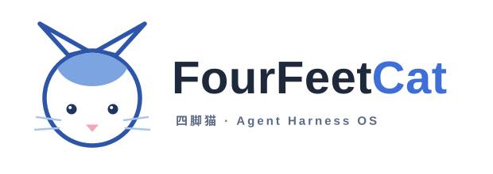
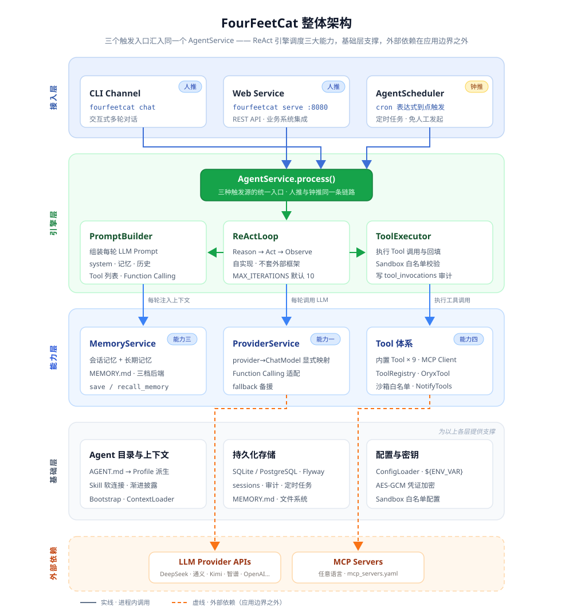

<div align="center">



# FourFeetCat（四脚猫）

**企业 Agent 操作系统（Agent Harness OS）**

用一句自然语言发布一个任务 → 底座把它拆解 → 组织一支 Agent 团队 → 多个 Agent 分工协作 → 交付一个结果。

让每一家公司，都能用自然语言跑起来自己的 Agent。不做三脚猫——四脚稳稳着地，稳得住一队 Agent。

[]()
[]()
[]()
[](LICENSE)
[]()

**自然语言(md) + Memory + Tool + MCP(Connector) + Skill + 知识库 + Notify = 一个 Agent**

一个目录定义一个 Agent，一个底座运行一群 Agent，私有部署，数据不出域。

[为什么需要 FourFeetCat](#为什么需要-fourfeetcat) · [架构](#架构) · [快速开始](#快速开始) · [模块说明](#模块说明) · [路线图](#路线图)

</div>

---

## 为什么需要 FourFeetCat

每家公司都有该交给 Agent 的活，但 Agent 大多还停在 demo，卡在四道门槛上：

1. **定义一个 Agent 要写代码**——最懂业务的人反而做不了
2. **云平台要把数据拿走**——合规过不去
3. **执行是黑盒**——没审计、没白名单、没人审批，企业不敢上生产
4. **跑一个容易、跑一群难**——没有人把「一群 Agent 的操作系统」这一层交给你

FourFeetCat 一次拆掉这四道门槛：**自然语言定义、私有部署、全链路审计加沙箱、为一整队 Agent 准备的生命周期与治理**。

更深一层的判断是：让 Agent 在生产环境可靠工作，瓶颈通常不在模型本身，而在 Agent 的运行环境——能不能拿到对的上下文、有没有受控的工具、调用能不能被隔离和审计、跨节点协作时消息能不能不丢不重地送达。FourFeetCat 做的不是又一个 Agent，而是让一群 Agent 可靠运行和协同的**底座本身**。

> **与相邻概念的边界**：框架（LangChain / Spring AI）给你代码、要你自己搭运行环境；编排平台（Dify / Coze）给你流程、跑在运行时之上；FourFeetCat 给你**运行时本身**——一个让 Agent 能常驻、可治理、可审计地跑起来的底座。它复用框架（LLM 调用层基于 Spring AI Alibaba），托住编排平台（可作其后端运行时），自己专注守在运行时这一层。

## 核心特性

- 🤖 **一个目录 = 一个 Agent**：一个包含 `AGENT.md` 的目录定义一个 Agent，不用写代码，多个 Agent 同实例并存
- ☕ **Java 原生**：基于 JDK 21 与 Spring Boot 3.x，单可执行 JAR 单二进制部署，复用现有 Java 运维工具链
- 🔒 **私有可控**：装在企业自己的 K8s、虚拟机或物理机上，数据不出域，不锁任何云
- 🛡️ **安全隔离**：工具调用经文件、命令、网络白名单校验，凭证走企业密钥体系不落地，全链路可审计，安全从第一天就在架构里
- 🧠 **自实现 ReAct**：核心推理循环自己实现，不套外部 Agent 框架，机制完全可控
- 🔌 **对接开放标准**：工具用 MCP、Agent 协作用 A2A、Agent 目录借 Anthropic Agent Skills 的形态，与生态协同不另立协议
- 🧩 **三档工具扩展**：从零代码 Agent 目录到自写 MCP server 到原生方法，按门槛自由选择
- 💾 **跨对话记忆**：会话加长期两层记忆，让 Agent 记得住上下文
- 🌐 **无状态可扩展**：运行实例无状态、状态外置，从架构起为走向分布式留好路

## 架构

FourFeetCat 是一个 Spring Boot 单体应用，三个触发入口（CLI 人推、REST API 人推、定时任务钟推）最终都汇入同一个引擎，`ReActLoop` 不感知消息从哪个入口来：



*五层自上而下：接入层（三个触发入口）→ 引擎层（`AgentService` 统一入口 + `ReActLoop` 调度 `PromptBuilder`/`ToolExecutor`）→ 能力层（Provider / Memory / Tool）→ 基础层（Agent 目录、存储、配置密钥）；虚线为应用边界之外的外部依赖（LLM APIs、MCP Servers）。*

- **引擎**（`ReActLoop`）：Reason → Act → Observe 循环——LLM 思考是否调工具、调哪个，FourFeetCat 执行后回填结果，直到给出最终响应或达到最大迭代次数（默认 10）。核心循环自己实现，约数十行 Java，不依赖 Spring AI 的 Agent 抽象
- **能力**：Provider（对接 DeepSeek、通义、Kimi、智谱、Anthropic、OpenAI 等，运行时切换无锁定）、Memory（会话记忆 + 长期记忆，三档可插拔后端）、Tool（内置文件/Shell/HTTP/通知/记忆九个工具 + MCP 接入）
- **基础**：`AGENT.md` frontmatter 派生 `Profile`，Skill 经渐进式披露按需加载；`tool_invocations` / `llm_calls` 审计表 day one 落库

## 快速开始

### 前置条件

- JDK 21+
- 一个 LLM API Key（DeepSeek / Kimi / 通义等任一）

### 三步跑起来

```bash
# 1. 初始化工作区（幂等，不覆盖已有文件）
fourfeetcat init

# 2. 注入模型凭证（不明文写进配置）
export DEEPSEEK_API_KEY=sk-...

# 3. 开始对话
fourfeetcat chat
```

首次运行后，一个 Agent 就是一个目录：

```
.fourfeetcat/agents/my-agent/AGENT.md    # frontmatter = 运行配置，正文 = 任务指令
```

```markdown
---
name: my-agent
provider:
  name: deepseek
  model: deepseek-chat
  api_key: ${DEEPSEEK_API_KEY}
tools:
  - read_file
  - http_get
  - save_memory
---
你是一个……的助手。（这段正文就是 Agent 的指令）
```

### 三种运行模式

```bash
fourfeetcat chat                 # 交互对话（开发调试）
fourfeetcat serve --port 8080    # REST API 服务（业务系统 HTTP 集成）
fourfeetcat gateway              # 守护进程（多 Channel 常驻 + 定时任务）
```

三种模式共享同一份 Agent 配置和 Session 存储。业务系统集成：

```bash
# 无状态调用
curl -X POST http://localhost:8080/api/v1/agents/my-agent/invoke \
  -H "Content-Type: application/json" \
  -d '{"message": "帮我查一下今天的天气"}'

# 会话保持
curl -X POST http://localhost:8080/api/v1/sessions
curl -X POST http://localhost:8080/api/v1/sessions/<id>/messages \
  -H "Content-Type: application/json" -d '{"message": "记住我偏好简洁回复"}'
```

完整 API 见 Swagger UI（`/swagger-ui`），核心 10 端点覆盖会话管理、Agent 调用、Profile / Memory / Tool 查询、健康检查。

### Docker 部署

```bash
docker run -d \
  -e FOURFEETCAT_ROOT=/data/.fourfeetcat \
  -e DEEPSEEK_API_KEY=sk-... \
  -v fourfeetcat-data:/data \
  -p 8080:8080 \
  ghcr.io/oryx-labs/fourfeetcat:latest
```

镜像内不跑 Maven，直接 COPY 胖 JAR 进 JRE 基础镜像；全部状态在 `/data` 卷；非 root（uid 1000）运行，内置 `/api/v1/health` 健康检查。

### 从源码构建

```bash
git clone <repo-url> && cd FourFeetCat
mvn clean package
java -jar fourfeetcat-boot/target/*.jar chat
```

> **扩展现有能力**：零代码 = 写 Agent 目录 + 复用社区现成 MCP server（主推）；轻代码 = 用任何语言自写 MCP server 配进 `mcp_servers.yaml`；重代码 = Java `@Tool` 注解 Spring Bean。能用低门槛就不用高门槛。

## 模块说明

Maven 多模块工程（14 个），骨架先立 9 个基础模块，其余随能力演进增补。模块间通过接口解耦，扩展只加新模块不改核心：

| 模块 | 职责 |
|---|---|
| `fourfeetcat-core` | 核心抽象：`ReActLoop`、`PromptBuilder`、`ToolExecutor`、`AgentService`（三触发源统一入口）、`AgentScheduler`、Agent 目录加载、channel / knowledge 契约 |
| `fourfeetcat-provider` | 能力一：`ProviderService`、Function Calling 适配、provider name → ChatModel 显式映射 |
| `fourfeetcat-memory` | 能力三：`MemoryService` 统一门面、长期记忆三档后端、`save_memory` / `recall_memory` |
| `fourfeetcat-knowledge` | 知识库：本地后端、解析/切分/向量化流水线、双路召回 + RRF 融合检索 |
| `fourfeetcat-tool` | 能力四（三合一）：内置 Tool、MCP Client、`ToolRegistry`、`Sandbox` 接口 + `WhitelistSandbox`、通知适配器 |
| `fourfeetcat-web` | 能力五：`WebServer`、REST Controller、OpenAPI 文档 |
| `fourfeetcat-channel-cli` | CLI Channel（`fourfeetcat chat`） |
| `fourfeetcat-channel-feishu` / `-wecom` / `-dingtalk` | 三大 IM 入站渠道：长连接收消息、@ 判定剥离、出站过沙箱、自动重连（契约在 core，依赖倒置） |
| `fourfeetcat-persona` | 人格模板库（copy-in）：12 个内置预设 + 自定义 CRUD |
| `fourfeetcat-storage` | 持久化：SQLite / PostgreSQL + Flyway、Session / 审计 / 定时任务 Repository |
| `fourfeetcat-cli` | Picocli 命令行入口、`ConfigLoader` |
| `fourfeetcat-boot` | Spring Boot 启动模块、自动配置、依赖聚合 |

## 核心概念

| 术语 | 一句话 |
|---|---|
| **Agent** | 一个目录 `.fourfeetcat/agents/<name>/`：`AGENT.md`（frontmatter 配置 + 正文指令）+ 可选 `skills/` 软连接、`scripts/` |
| **Profile** | 由 `AGENT.md` frontmatter 派生的运行时配置对象，决定 Agent 怎么跑 |
| **Provider** | LLM API 抽象，Agent 不感知调的是哪家模型 |
| **Skill** | 公共能力实体存 `.fourfeetcat/skills/`，Agent 经本地 `skills/` 软连接绑定；prompt 只注入元数据，正文按需读取 |
| **Tool** | 可调用的外部能力，统一 `CatTool` 抽象，内置九个 + MCP / `@Tool` 扩展 |
| **Memory** | 会话记忆 + 长期记忆（`MEMORY.md`），跨对话记住偏好 |
| **Channel** | 消息入口（CLI / 飞书 / 企微 / 钉钉） |
| **Sandbox** | 工具执行的白名单校验（文件路径 / Shell 命令 / HTTP 域名 / SMTP 端点） |

## 文档

| 文档 | 内容 |
|---|---|
| [`docs/fourfeetcat.md`](docs/fourfeetcat.md) | 项目定位与愿景 |
| [`docs/DemandAnalysis.md`](docs/DemandAnalysis.md) | 需求文档（What：功能 / 非功能需求、验收标准） |
| [`docs/TechnicalSolution.md`](docs/TechnicalSolution.md) | 技术方案（How：架构、模块、数据模型、关键决策） |
| [`docs/IndustryResearch.md`](docs/IndustryResearch.md) | 业界调研（Agent OS 格局、Java 生态缺位、定位论证） |
| [`docs/AiProgrammingGuide.md`](docs/AiProgrammingGuide.md) | AI 编程实施指南（Spec-Kit + Claude Code 混合模式） |
| [`CLAUDE.md`](CLAUDE.md) | Claude Code 项目指南 |

## 路线图

开发理念：**慢就是快，克制且聚焦**。先把单机运行时内核做扎实，再逐步生长出分布式能力。

- **阶段一（当前）单机运行时内核**——五大核心能力跑通：配置即 Agent、多 Agent 并存、REST API 接入、对接 MCP
- **阶段二（规划）底座分布式**——节点无状态化、状态外置、多副本部署，支撑更大规模与高可用
- **阶段三（愿景）跨节点 Agent 协作**——Agent 通信底座，对接 A2A，跨节点发现、委托、可靠异步协同
- **横向能力（伴随各阶段）**——多租户、SSO、完整审计、工具策略、可观测、Web 管理台

## 社区

FourFeetCat 由 [oryx-labs](docs/oryx-labs.md) 社区维护——一个 AI coding 驱动的 AI 探索社区，聚焦 AI infra、Agent、AI 应用、AI 工具四个方向，纯粹由爱好驱动。欢迎加入，找几个同样起劲的人，做点有趣的东西。

## License

[Apache License 2.0](LICENSE)
